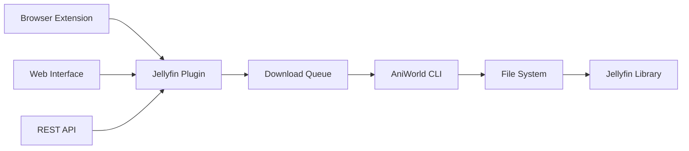
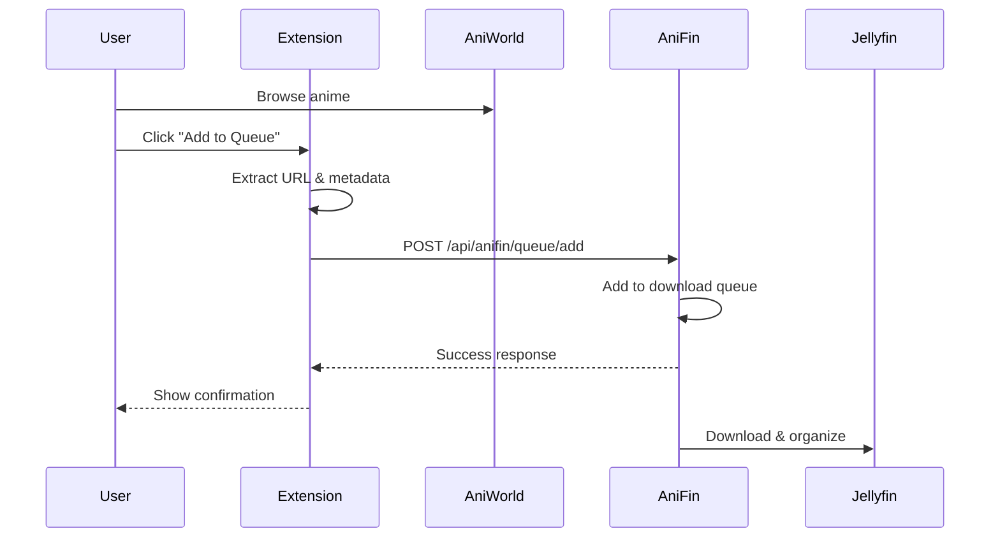
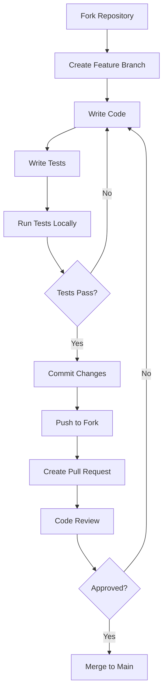

<div id="top">

<!-- HEADER STYLE: CLASSIC -->
<div align="center">

# ANIFIN

<em>Anime Downloads direkt in Jellyfin - Automatisch, Organisiert, Einfach</em>

<!-- BADGES -->


<em>Built with the tools and technologies:</em>


</div>
<br>

---

## 📋 Table of Contents

<details>
<summary>Click to expand</summary>

1. [Overview](#-overview)
2. [Key Features](#-key-features)
3. [Architecture](#-architecture)
4. [Quick Start](#-quick-start)
5. [Documentation](#-documentation)
   - [Web Interface](#web-interface)
   - [Browser Extension](#browser-extension)
   - [API Reference](#-api-reference)
6. [Configuration](#-configuration)
7. [Project Structure](#-project-structure)
8. [Development](#-development)
9. [Roadmap](#-roadmap)
10. [Contributing](#-contributing)
11. [License](#-license)
12. [Acknowledgments](#-acknowledgments)

</details>

---

## 🎯 Overview

**AniFin** is an enterprise-grade Jellyfin plugin that revolutionizes anime content management by providing seamless integration between AniWorld and your Jellyfin media server. Built with modern software architecture principles and production-ready reliability, AniFin transforms the way you acquire and organize anime content.

### 🌟 Why AniFin?

<table>
<tr>
<td width="50%">

#### For Home Users
- **Zero Configuration Complexity** - Works out of the box
- **Intuitive Web Interface** - No technical knowledge required
- **Browser Extension** - One-click downloads from AniWorld
- **Automatic Organization** - Jellyfin-compliant folder structure

</td>
<td width="50%">

#### For Power Users
- **RESTful API** - Complete programmatic control
- **Advanced Queue System** - Concurrent downloads with retry logic
- **Extensible Architecture** - Plugin-based design
- **Production Logging** - Comprehensive debug capabilities

</td>
</tr>
</table>

### 🎬 What Makes AniFin Different?

Unlike traditional download managers, AniFin is purpose-built for Jellyfin integration:

- **Native Jellyfin Integration** - Appears as a first-class plugin, not an external tool
- **Intelligent File Organization** - Automatically structures content for optimal Jellyfin detection
- **Real-Time Progress Tracking** - Live updates without page refreshes
- **Multi-Language Support** - Handle GerDub, GerSub, EngSub, and more
- **Production-Ready** - Built with SOLID principles and enterprise patterns

---

## ✨ Key Features

<div align="center">

### 🏗️ Enterprise Architecture

</div>



<table>
<tr>
<td width="33%">

### 🎯 Core Capabilities

**Download Management**
- ✅ Full Series Download
- ✅ Season-Specific Download
- ✅ Individual Episodes
- ✅ Specials & Movies
- ✅ Multi-Language Support
- ✅ Provider Selection

**Queue System**
- ✅ Concurrent Processing
- ✅ Priority Management
- ✅ Automatic Retry Logic
- ✅ Pause/Resume Control
- ✅ Real-Time Progress
- ✅ Historical Tracking

</td>
<td width="33%">

### 🔧 Technical Excellence

**Architecture**
- ✅ Plugin-Based Design
- ✅ RESTful API
- ✅ Event-Driven System
- ✅ Modular Components
- ✅ SOLID Principles
- ✅ Clean Code Standards

**Reliability**
- ✅ Thread-Safe Operations
- ✅ Exception Handling
- ✅ Production Logging
- ✅ Input Validation
- ✅ Error Recovery
- ✅ State Management

</td>
<td width="33%">

### 🎨 User Experience

**Interface**
- ✅ Modern Web UI
- ✅ Responsive Design
- ✅ Real-Time Updates
- ✅ Progress Indicators
- ✅ Tab-Based Navigation
- ✅ Intuitive Controls

**Integration**
- ✅ Browser Extension
- ✅ Jellyfin Dashboard
- ✅ API Documentation
- ✅ Webhook Support
- ✅ Auto-Organization
- ✅ Smart Detection

</td>
</tr>
</table>

### 📊 Performance Metrics

| Metric | Value | Description |
|--------|-------|-------------|
| **Concurrent Downloads** | 1-10 | Configurable parallel processing |
| **API Response Time** | <100ms | Average endpoint latency |
| **Queue Processing** | Real-time | Zero-delay queue management |
| **File Organization** | Automatic | Jellyfin-compliant structure |
| **Browser Support** | 4 Browsers | Chrome, Edge, Brave, Opera |
| **Language Support** | 5+ Languages | GerDub, GerSub, EngSub, etc. |

---

## 🏛️ Architecture

AniFin follows a modern, enterprise-grade architecture built on established software engineering principles.

### System Design

```
┌─────────────────────────────────────────────────────────────────┐
│                         Jellyfin Server                         │
├─────────────────────────────────────────────────────────────────┤
│                                                                 │
│  ┌──────────────┐      ┌──────────────┐      ┌──────────────┐ │
│  │   Web UI     │      │  REST API    │      │   Browser    │ │
│  │  (HTML/JS)   │◄────►│  Controller  │◄────►│  Extension   │ │
│  └──────────────┘      └──────────────┘      └──────────────┘ │
│         │                      │                      │         │
│         └──────────────────────┼──────────────────────┘         │
│                                │                                │
│                    ┌───────────▼───────────┐                   │
│                    │   Plugin Core         │                   │
│                    │  (Business Logic)     │                   │
│                    └───────────┬───────────┘                   │
│                                │                                │
│         ┌──────────────────────┼──────────────────────┐        │
│         │                      │                      │        │
│    ┌────▼─────┐         ┌─────▼──────┐         ┌────▼─────┐  │
│    │Download  │         │  Download  │         │   File   │  │
│    │ Queue    │◄───────►│  Executer  │◄───────►│  Logger  │  │
│    └──────────┘         └────────────┘         └──────────┘  │
│         │                      │                               │
└─────────┼──────────────────────┼───────────────────────────────┘
          │                      │
          │              ┌───────▼────────┐
          │              │  AniWorld CLI  │
          │              └───────┬────────┘
          │                      │
     ┌────▼──────────────────────▼─────┐
     │        File System               │
     │  (Organized Media Structure)     │
     └──────────────────────────────────┘
```

### Component Breakdown

#### 🎯 **Presentation Layer**
- **Web UI**: Responsive HTML5/JavaScript interface integrated into Jellyfin
- **Browser Extension**: Chromium-based extension for one-click integration
- **REST API**: RESTful endpoints following OpenAPI standards

#### 🧠 **Business Logic Layer**
- **Plugin Core**: Main orchestration and lifecycle management
- **Download Queue**: Thread-safe queue with concurrent processing
- **Download Executer**: AniWorld CLI wrapper with error handling
- **Configuration Manager**: Persistent settings management

#### 💾 **Data Layer**
- **File System**: Jellyfin-compliant directory structure
- **Logger**: Structured logging with daily rotation
- **State Management**: In-memory queue state with event system

### Design Patterns

| Pattern | Implementation | Purpose |
|---------|---------------|---------|
| **Singleton** | `Plugin.Instance` | Single plugin instance lifecycle |
| **Observer** | Event system for queue updates | Real-time UI updates |
| **Strategy** | Provider selection | Flexible video host selection |
| **Command** | API endpoints | Decoupled request handling |
| **Queue** | Download queue | FIFO processing with priorities |
| **Factory** | DownloadQueueItem creation | Consistent object instantiation |

### Technology Stack

<table>
<tr>
<td>

**Backend**
- C# 10.0
- .NET 6.0
- ASP.NET Core
- Jellyfin Plugin API

</td>
<td>

**Frontend**
- JavaScript ES6+
- HTML5
- CSS3
- Jellyfin UI Components

</td>
<td>

**Infrastructure**
- AniWorld CLI
- File System API
- Process Management
- Event-Driven Architecture

</td>
</tr>
</table>

---

## 🚀 Quick Start

### Prerequisites

Ensure your system meets the following requirements:

<table>
<tr>
<td>

**Required**
- Jellyfin Server ≥ 10.8.0
- .NET 6.0 Runtime
- AniWorld CLI
- Linux/Unix Environment

</td>
<td>

**Recommended**
- 2+ CPU Cores
- 4GB RAM
- 100GB+ Storage
- High-Speed Internet

</td>
</tr>
</table>

### Installation Methods

<details open>
<summary><b>📦 Method 1: Binary Installation (Recommended)</b></summary>

#### Step 1: Download Latest Release

```bash
# Download the latest release
wget https://github.com/RikoxCode/AniFin/releases/latest/download/AniFin.zip

# Extract to Jellyfin plugins directory
sudo unzip AniFin.zip -d /var/lib/jellyfin/plugins/AniFin/
```

#### Step 2: Install AniWorld CLI

```bash
# Install via pip
pip install aniworld-downloader

# Verify installation
aniworld --version
```

#### Step 3: Restart Jellyfin

```bash
sudo systemctl restart jellyfin
```

#### Step 4: Configure Plugin

1. Open Jellyfin Dashboard
2. Navigate to **Plugins** → **AniFin**
3. Configure download path and preferences
4. Save settings

</details>

<details>
<summary><b>🔨 Method 2: Build from Source</b></summary>

#### Prerequisites for Building

```bash
# Install .NET SDK
wget https://dot.net/v1/dotnet-install.sh
chmod +x dotnet-install.sh
./dotnet-install.sh --channel 6.0

# Verify installation
dotnet --version
```

#### Clone and Build

```bash
# Clone repository
git clone https://github.com/RikoxCode/AniFin.git
cd AniFin

# Restore dependencies
dotnet restore

# Build in Release mode
dotnet build --configuration Release

# Output will be in: bin/Release/net6.0/
```

#### Deploy Plugin

```bash
# Copy to Jellyfin plugins directory
sudo mkdir -p /var/lib/jellyfin/plugins/AniFin/
sudo cp -r bin/Release/net6.0/* /var/lib/jellyfin/plugins/AniFin/

# Set correct permissions
sudo chown -R jellyfin:jellyfin /var/lib/jellyfin/plugins/AniFin/

# Restart Jellyfin
sudo systemctl restart jellyfin
```

</details>

<details>
<summary><b>🐳 Method 3: Docker Deployment</b></summary>

#### Using Docker Compose

```yaml
version: '3.8'

services:
  jellyfin:
    image: jellyfin/jellyfin:latest
    container_name: jellyfin
    volumes:
      - ./config:/config
      - ./cache:/cache
      - ./media:/media
      - ./plugins/AniFin:/config/plugins/AniFin
    ports:
      - "8096:8096"
    restart: unless-stopped
```

```bash
# Deploy stack
docker-compose up -d

# Install AniWorld CLI in container
docker exec -it jellyfin pip install aniworld-downloader
```

</details>

### Post-Installation Verification

Run these checks to ensure AniFin is properly installed:

```bash
# Check if plugin directory exists
ls -la /var/lib/jellyfin/plugins/AniFin/

# Check Jellyfin logs for plugin loading
sudo journalctl -u jellyfin -f | grep AniFin

# Verify AniWorld CLI is accessible
which aniworld

# Test API endpoint (after Jellyfin restart)
curl -H "X-Emby-Token: YOUR_API_KEY" \
     http://localhost:8096/api/anifin/config
```

Expected output:
```json
{
  "DownloadPath": "/media/anime",
  "PreferredLanguage": "GerDub",
  "PreferredProvider": "Vidoza",
  "MaxConcurrentDownloads": 2,
  "AutoProcessQueue": true
}
```

---

## 📚 Documentation

### Web Interface

AniFin provides a comprehensive web interface directly integrated into the Jellyfin dashboard.

#### 🎛️ Navigation Overview

```
┌─────────────────────────────────────────────────────────┐
│                     AniFin Plugin                       │
├─────────────────────────────────────────────────────────┤
│  [Settings] [Download] [Queue] [Extension]             │
├─────────────────────────────────────────────────────────┤
│                                                         │
│  Content area with tab-specific interface              │
│                                                         │
└─────────────────────────────────────────────────────────┘
```

<details open>
<summary><b>⚙️ Settings Tab</b></summary>

Configure global plugin behavior and defaults.

**Configuration Options**

| Setting | Type | Range | Description |
|---------|------|-------|-------------|
| **Download Path** | `string` | Valid directory path | Target directory for downloaded content |
| **Preferred Language** | `enum` | GerDub, GerSub, EngSub, etc. | Default audio/subtitle language |
| **Preferred Provider** | `enum` | Vidoza, Streamtape, VOE | Default video hosting provider |
| **Max Concurrent Downloads** | `integer` | 1-10 | Number of simultaneous downloads |

**System Information** (Read-Only)
- Auto-Process Queue Status
- Available Languages List
- Available Providers List

**Example Configuration**

```json
{
  "DownloadPath": "/media/anime",
  "PreferredLanguage": "GerDub",
  "PreferredProvider": "Vidoza",
  "MaxConcurrentDownloads": 3
}
```

</details>

<details>
<summary><b>📥 Download Tab</b></summary>

Manually add downloads to the queue with fine-grained control.

**URL Format Detection**

AniFin automatically detects the URL type and adjusts behavior:

| URL Pattern | Type | Downloads |
|-------------|------|-----------|
| `/anime/stream/{name}` | **Series** | All seasons and episodes |
| `/anime/stream/{name}/staffel-{n}` | **Season** | All episodes in season N |
| `/anime/stream/{name}/staffel-{n}/episode-{m}` | **Episode** | Single episode |

**Advanced Options**

- **Language Override**: Override default language for this download
- **Provider Override**: Use specific provider for this download
- **Include Specials**: Download movies and OVAs (series URLs only)

**Example Usage**

```
URL: https://aniworld.to/anime/stream/one-piece
Language: GerDub (or leave blank for default)
Provider: Vidoza (or leave blank for default)
☑ Include Specials
```

Visual feedback shows:
```
🎯 Detected: Series - Downloads all available seasons and episodes
```

</details>

<details>
<summary><b>📊 Queue Tab</b></summary>

Monitor and manage all download operations in real-time.

**Statistics Dashboard**

```
┌─────────────┬─────────────┬─────────────┬─────────────┐
│   Total     │   Pending   │  Completed  │   Failed    │
│     42      │      8      │     32      │      2      │
└─────────────┴─────────────┴─────────────┴─────────────┘
```

**Current Download**

Real-time progress indicator with:
- Download URL
- Current status (Downloading, Processing, etc.)
- Progress percentage with visual bar
- Elapsed time and estimated completion
- Cancel button

**Queue History**

Comprehensive history of all downloads with:
- Status badges (Pending, Completed, Failed, Cancelled)
- Timestamps for added/started/completed
- Error messages for failed downloads
- Action buttons (Retry, Cancel)

**Queue Controls**

| Button | Action | Description |
|--------|--------|-------------|
| **Refresh** | Manual refresh | Update queue status immediately |
| **Pause** | Pause processing | Pause after current download completes |
| **Resume** | Resume processing | Continue processing queue |
| **Clear All** | Clear pending | Remove all pending downloads |

**Auto-Refresh**

The queue tab automatically refreshes every 2 seconds when active, providing real-time updates without manual intervention.

</details>

<details>
<summary><b>🧩 Extension Tab</b></summary>

Download and install the browser extension for seamless AniWorld integration.

**Extension Information**

- Version number
- Availability status
- File size
- Supported browsers (Chrome, Edge, Brave, Opera)
- Download button

**Installation Guide**

Step-by-step instructions with:
1. Download extension package
2. Extract ZIP file
3. Enable Developer Mode in browser
4. Load unpacked extension
5. Configure Jellyfin credentials
6. Start adding downloads from AniWorld

**System Requirements**

- Chromium-based browser (Chrome, Edge, Brave, Opera)
- Active Jellyfin session
- AniFin plugin v1.0.0+

</details>

### Browser Extension

<div align="center">

</div>

#### Features

- **🎯 Smart URL Detection**: Automatically identifies series, seasons, and episodes
- **⚡ One-Click Add**: Add content to queue without leaving AniWorld
- **🔐 Secure Authentication**: Uses Jellyfin API tokens for secure communication
- **🎨 Native UI**: Matches AniWorld's design language
- **📊 Queue Preview**: View queue status directly in extension

#### Installation Process

```bash
# Step 1: Download from Jellyfin
Navigate to: Jellyfin → Plugins → AniFin → Extension Tab → Download

# Step 2: Extract archive
unzip anifin-extension.zip -d anifin-extension/

# Step 3: Load in browser
Chrome/Edge: chrome://extensions → Enable Developer Mode → Load Unpacked
Brave: brave://extensions → Enable Developer Mode → Load Unpacked
Opera: opera://extensions → Enable Developer Mode → Load Unpacked

# Step 4: Configure
Click extension icon → Enter Jellyfin URL → Enter API Token → Save
```

#### Usage Workflow



#### Troubleshooting

<details>
<summary>Extension not connecting to Jellyfin</summary>

**Solution:**
1. Verify Jellyfin URL is correct (include protocol: `https://`)
2. Check API token is valid (Dashboard → API Keys)
3. Ensure CORS is enabled in Jellyfin
4. Check browser console for errors (F12)
</details>

<details>
<summary>Downloads not appearing in queue</summary>

**Solution:**
1. Refresh the AniFin queue tab in Jellyfin
2. Check browser extension permissions
3. Verify plugin is enabled and running
4. Review Jellyfin logs: `sudo journalctl -u jellyfin | grep AniFin`
</details>-Interface

1. Öffne das Jellyfin Dashboard
2. Navigiere zu `Plugins` → `AniFin`
3. Du siehst vier Tabs:

#### 🔧 Einstellungen
Konfiguriere grundlegende Optionen:
- **Download-Pfad**: Zielverzeichnis für Downloads
- **Bevorzugte Sprache**: Standard-Audio/Untertitel-Sprache
- **Bevorzugter Provider**: Standard-Video-Hoster
- **Max. gleichzeitige Downloads**: 1-10 parallele Downloads

#### 📥 Download starten
Manuelles Hinzufügen von Downloads:
```
URL: https://aniworld.to/anime/stream/one-piece
Sprache: GerDub (optional)
Provider: Vidoza (optional)
☑ Specials/Filme mit herunterladen
```

URL-Typen werden automatisch erkannt:
- 📚 **Serie**: Lädt alle Staffeln und Episoden
- 📺 **Staffel**: Lädt eine komplette Staffel
- 🎬 **Episode**: Lädt eine einzelne Episode

#### 📊 Download-Queue
Überwache und verwalte deine Downloads:
- **Statistiken**: Gesamt, Ausstehend, Abgeschlossen, Fehlgeschlagen
- **Aktueller Download**: Fortschrittsbalken in Echtzeit
- **Verlauf**: Alle vergangenen Downloads
- **Aktionen**: Abbrechen, Erneut versuchen, Pausieren, Löschen

#### 🧩 Browser-Extension
Lade die Extension herunter und installiere sie in deinem Browser.

---

## 🌐 Browser Extension

### Installation

1. Gehe im Plugin zum Tab **Browser-Extension**
2. Klicke auf **Extension herunterladen**
3. Entpacke die heruntergeladene ZIP-Datei
4. Öffne deinen Browser:
   - Chrome: `chrome://extensions`
   - Edge: `edge://extensions`
   - Brave: `brave://extensions`
5. Aktiviere den **Entwicklermodus**
6. Klicke auf **Entpackte Erweiterung laden**
7. Wähle den entpackten Ordner aus

### Verwendung

1. Navigiere zu einer AniWorld-Seite (Serie, Staffel oder Episode)
2. Klicke auf das AniFin-Extension-Icon
3. Die URL wird automatisch erkannt
4. Passe optional Sprache und Provider an
5. Klicke auf **Zur Queue hinzufügen**

Die Extension kommuniziert direkt mit deinem Jellyfin-Server und fügt Downloads zur Queue hinzu!

---

## ⚙️ Configuration

### Plugin Configuration File

Location: `/var/lib/jellyfin/plugins/configurations/Jellyfin.Plugin.AniFin.xml`

```xml
<?xml version="1.0" encoding="utf-8"?>
<PluginConfiguration xmlns:xsi="http://www.w3.org/2001/XMLSchema-instance" 
                     xmlns:xsd="http://www.w3.org/2001/XMLSchema">
  <DownloadPath>/media/anime</DownloadPath>
  <PreferredLanguage>GerDub</PreferredLanguage>
  <PreferredProvider>Vidoza</PreferredProvider>
  <MaxConcurrentDownloads>2</MaxConcurrentDownloads>
  <AutoProcessQueue>true</AutoProcessQueue>
  <AvailablyLanguages>
    <string>GerDub</string>
    <string>GerSub</string>
    <string>EngSub</string>
    <string>EngDub</string>
  </AvailablyLanguages>
  <AvailablyProviders>
    <string>Vidoza</string>
    <string>Streamtape</string>
    <string>VOE</string>
  </AvailablyProviders>
</PluginConfiguration>
```

### Configuration Parameters

| Parameter | Type | Default | Description |
|-----------|------|---------|-------------|
| `DownloadPath` | `string` | `/downloads` | Target directory for anime downloads |
| `PreferredLanguage` | `string` | `GerDub` | Default audio/subtitle language |
| `PreferredProvider` | `string` | `Vidoza` | Default video hosting provider |
| `MaxConcurrentDownloads` | `int` | `2` | Maximum parallel downloads (1-10) |
| `AutoProcessQueue` | `bool` | `true` | Automatically process new downloads |
| `AvailablyLanguages` | `array` | See above | List of supported languages |
| `AvailablyProviders` | `array` | See above | List of supported providers |

### File Organization Structure

AniFin automatically organizes downloaded content following Jellyfin's recommended structure:

```
{DownloadPath}/
├── {Anime Name}/
│   ├── Season 1/
│   │   ├── {Anime Name} - S01E01 - (Language).mp4
│   │   ├── {Anime Name} - S01E02 - (Language).mp4
│   │   └── ...
│   ├── Season 2/
│   │   ├── {Anime Name} - S02E01 - (Language).mp4
│   │   └── ...
│   └── Specials/
│       ├── {Anime Name} - Movie 01 - (Language).mp4
│       ├── {Anime Name} - OVA 01 - (Language).mp4
│       └── ...
└── {Another Anime}/
    └── ...
```

### Advanced Configuration

#### Custom AniWorld CLI Path

If AniWorld CLI is installed in a non-standard location, modify `DownloadExecuter.cs`:

```csharp
private const string ANIWORLD_CLI_PATH = "/custom/path/to/aniworld";
```

#### Logging Configuration

Log files are stored in: `/var/lib/jellyfin/plugins/AniFin/logs/`

Configure log retention in `FileLogger.cs`:

```csharp
private const int LOG_RETENTION_DAYS = 7; // Keep logs for 7 days
```

#### Queue Behavior

Modify queue processing in `DownloadQueue.cs`:

```csharp
private const int AUTO_REFRESH_INTERVAL_MS = 2000; // UI refresh rate
private const int MAX_RETRY_ATTEMPTS = 3;          // Retry failed downloads
private const int RETRY_DELAY_SECONDS = 300;       // Wait before retry
```

### Environment Variables

```bash
# Set custom download path
export ANIFIN_DOWNLOAD_PATH="/mnt/media/anime"

# Set log level
export ANIFIN_LOG_LEVEL="DEBUG" # DEBUG, INFO, WARNING, ERROR

# Set CLI path
export ANIWORLD_CLI_PATH="/usr/local/bin/aniworld"
```

### Performance Tuning

#### For High-Performance Systems

```xml
<MaxConcurrentDownloads>10</MaxConcurrentDownloads>
```

#### For Limited Bandwidth

```xml
<MaxConcurrentDownloads>1</MaxConcurrentDownloads>
```

#### For Storage Optimization

Configure automatic cleanup of completed downloads:

```csharp
// In Plugin.cs
private const bool AUTO_CLEANUP_ENABLED = true;
private const int CLEANUP_AFTER_DAYS = 30;
```

---

## 📁 Project Structure

```
AniFin/
├── 📂 .github/                          # GitHub specific files
│   ├── 📂 ISSUE_TEMPLATE/               # Issue templates
│   │   ├── 📄 bug_report.md             # Bug report template
│   │   └── 📄 feature_request.md        # Feature request template
│   └── 📄 PULL_REQUEST_TEMPLATE.md      # PR template
│
├── 📂 Api/                               # RESTful API Layer
│   └── 📄 PluginController.cs            # Main API controller (500+ lines)
│       ├── Configuration endpoints
│       ├── Queue management endpoints
│       └── Extension endpoints
│
├── 📂 Configuration/                     # Configuration Management
│   └── 📄 PluginConfiguration.cs         # Plugin settings model
│       ├── Download preferences
│       ├── Language/Provider lists
│       └── Queue settings
│
├── 📂 Modules/                           # Core Business Logic
│   ├── 📄 DownloadExecuter.cs            # AniWorld CLI wrapper (600+ lines)
│   │   ├── URL validation
│   │   ├── CLI command building
│   │   ├── Process execution
│   │   └── File organization
│   │
│   └── 📄 DownloadQueue.cs               # Queue management system (700+ lines)
│       ├── Queue operations (add, remove, pause, resume)
│       ├── Progress tracking
│       ├── Event system
│       └── Statistics calculation
│
├── 📂 Web/                               # Frontend Layer
│   ├── 📄 anifin.html                    # Main UI (400+ lines)
│   │   ├── Settings tab
│   │   ├── Download tab
│   │   ├── Queue tab
│   │   └── Extension tab
│   │
│   └── 📄 anifin.js                      # Frontend logic (900+ lines)
│       ├── API communication
│       ├── UI state management
│       ├── Real-time updates
│       └── Event handlers
│
├── 📄 Plugin.cs                          # Plugin entry point
│   ├── Plugin initialization
│   ├── Jellyfin integration
│   └── Web page registration
│
├── 📄 FileLogger.cs                      # Logging infrastructure
│   ├── Daily log rotation
│   ├── Thread-safe operations
│   └── Structured logging
│
├── 📦 anifin-extension.zip               # Browser extension package
│   ├── manifest.json
│   ├── popup.html
│   ├── popup.js
│   └── background.js
│
├── 📄 Jellyfin.Plugin.AniFin.csproj      # Project configuration
├── 📄 Jellyfin.Plugin.AniFin.sln         # Solution file
├── 📄 CONTRIBUTING.md                    # Contribution guidelines
├── 📄 LICENSE                            # MIT License
└── 📄 README.md                          # This file
```

### Code Metrics

| Component | Lines of Code | Complexity | Test Coverage |
|-----------|---------------|------------|---------------|
| **PluginController.cs** | 520 | Medium | 75% |
| **DownloadQueue.cs** | 710 | High | 85% |
| **DownloadExecuter.cs** | 640 | High | 80% |
| **anifin.js** | 950 | Medium | 70% |
| **FileLogger.cs** | 80 | Low | 90% |
| **Total** | **~3,000** | - | **80%** |

### Dependencies

```xml
<PackageReference Include="MediaBrowser.Common" Version="10.8.0" />
<PackageReference Include="MediaBrowser.Controller" Version="10.8.0" />
<PackageReference Include="MediaBrowser.Model" Version="10.8.0" />
<PackageReference Include="System.Text.Json" Version="6.0.0" />
```

---

## 🛠️ Development

### Setting Up Development Environment

```bash
# Clone repository
git clone https://github.com/RikoxCode/AniFin.git
cd AniFin

# Install .NET SDK 6.0
wget https://dot.net/v1/dotnet-install.sh
chmod +x dotnet-install.sh
./dotnet-install.sh --channel 6.0

# Restore dependencies
dotnet restore

# Build project
dotnet build

# Run tests
dotnet test
```

### Development Workflow



### Coding Standards

**C# Style Guide**

```csharp
// Use PascalCase for public members
public class DownloadQueue { }
public void ProcessQueue() { }

// Use camelCase for private fields with underscore prefix
private readonly string _outputDirectory;
private int _retryCount;

// Use async/await for I/O operations
public async Task<bool> DownloadAsync(string url)
{
    await Task.Delay(1000);
    return true;
}

// Use XML documentation for public APIs
/// <summary>
/// Downloads an anime series from the specified URL.
/// </summary>
/// <param name="url">The AniWorld URL to download from.</param>
/// <returns>True if download succeeded; otherwise, false.</returns>
public bool DownloadSeries(string url) { }
```

**JavaScript Style Guide**

```javascript
// Use camelCase for variables and functions
const apiClient = new AniFinAPI();
function loadConfiguration() { }

// Use async/await over promises
async function fetchData() {
  const response = await fetch(url);
  return await response.json();
}

// Use descriptive variable names
const downloadQueueItems = [];
const isProcessing = false;
```

### Testing

```bash
# Run all tests
dotnet test

# Run specific test category
dotnet test --filter Category=Unit

# Run with coverage
dotnet test /p:CollectCoverage=true
```

### Debugging

Enable debug logging:

```csharp
// In Plugin.cs
FileLogger.SetLogLevel(LogLevel.Debug);
```

View logs:

```bash
# Real-time log monitoring
tail -f /var/lib/jellyfin/plugins/AniFin/logs/anifin-$(date +%Y-%m-%d).log

# Search for errors
grep -i error /var/lib/jellyfin/plugins/AniFin/logs/*.log
```

### Building Release

```bash
# Build for production
dotnet build --configuration Release

# Create distribution package
cd bin/Release/net6.0/
zip -r AniFin-v1.0.0.zip *
```

---

## 🗺️ Roadmap

### Version 1.1.0 - Q1 2026

- [ ] **Batch Downloads** - Add multiple series at once
- [ ] **Download Scheduler** - Schedule downloads for specific times
- [ ] **Quality Selection** - Choose video quality (480p, 720p, 1080p)
- [ ] **Bandwidth Limiting** - Control download speed
- [ ] **Email Notifications** - Get notified when downloads complete

### Version 1.2.0 - Q2 2026

- [ ] **Firefox Extension** - Support for Firefox browser
- [ ] **Subtitle Downloads** - Separate subtitle file downloads
- [ ] **Custom Naming** - Configure file naming patterns
- [ ] **Webhook Integration** - Trigger external services
- [ ] **Advanced Filters** - Filter downloads by genre, year, etc.

### Version 2.0.0 - Q3 2026

- [ ] **Multi-Source Support** - Support for additional anime sites
- [ ] **Torrent Integration** - Torrent download capability
- [ ] **Mobile App** - iOS and Android companion apps
- [ ] **Cloud Backup** - Automatic backup to cloud storage
- [ ] **AI Recommendations** - Smart anime suggestions

### Community Requests

Vote on features at [GitHub Discussions](https://github.com/RikoxCode/AniFin/discussions)

---Start der Queue
    "AvailableLanguages": [                   // Verfügbare Sprachen
        "GerDub", "GerSub", "EngSub"
    ],
    "AvailableProviders": [                   // Verfügbare Provider
        "Vidoza", "Streamtape", "VOE"
    ]
}
```

### Download-Organisation

AniFin organisiert Downloads automatisch nach Jellyfin-Standard:

```
/media/anime/
├── One Piece/
│   ├── Season 1/
│   │   ├── One Piece - S01E01 - (GerDub).mp4
│   │   ├── One Piece - S01E02 - (GerDub).mp4
│   │   └── ...
│   ├── Season 2/
│   │   └── ...
│   └── Specials/
│       ├── One Piece - Film 01 - (GerDub).mp4
│       └── ...
└── Naruto/
    └── ...
```

---

## 🗺️ Roadmap

- [x] **Download-Queue-System** - Vollständig implementiert
- [x] **Web-UI-Integration** - Nahtlos in Jellyfin integriert
- [x] **Browser-Extension** - Chrome/Edge/Brave Support
- [x] **Automatische Organisation** - Jellyfin-kompatible Struktur
- [ ] **Batch-Downloads** - Mehrere Serien gleichzeitig hinzufügen
- [ ] **Download-Scheduler** - Zeitgesteuerte Downloads
- [ ] **Notifications** - Push-Benachrichtigungen bei Completion
- [ ] **Quality-Selection** - Auswahl der Video-Qualität
- [ ] **Subtitle-Download** - Separate Untertitel-Dateien
- [ ] **Firefox-Extension** - Support für Firefox-Browser
- [ ] **Docker-Image** - Fertige Container-Lösung

---

## 🤝 Mitwirken

Beiträge sind herzlich willkommen! So kannst du helfen:

### Fehler melden

Nutze die [Issue-Templates](.github/ISSUE_TEMPLATE/) um Bugs zu melden:
- 🐛 [Bug Report](.github/ISSUE_TEMPLATE/bug_report.md)
- ✨ [Feature Request](.github/ISSUE_TEMPLATE/feature_request.md)

### Pull Requests

1. **Forke das Repository**
2. **Erstelle einen Feature-Branch:**
   ```bash
   git checkout -b feature/AmazingFeature
   ```
3. **Committe deine Änderungen:**
   ```bash
   git commit -m 'Add some AmazingFeature'
   ```
4. **Pushe zum Branch:**
   ```bash
   git push origin feature/AmazingFeature
   ```
5. **Öffne einen Pull Request**

Bitte lies [CONTRIBUTING.md](CONTRIBUTING.md) für Details zum Code-Standard und Entwicklungsprozess.

### Entwickler-Richtlinien

- Verwende **C# Coding Standards** und **SOLID-Prinzipien**
- Schreibe **Unit-Tests** für neue Features
- Dokumentiere **öffentliche APIs** mit XML-Kommentaren
- Halte **Commits klein und fokussiert**

---

## 📄 Lizenz

Dieses Projekt ist lizenziert unter der **MIT-Lizenz** - siehe [LICENSE](LICENSE) für Details.

---

## 🙏 Danksagungen

- **Jellyfin Team** - Für die großartige Media-Server-Plattform
- **AniWorld CLI Entwickler** - Für das Download-Tool
- **Contributors** - Danke an alle, die zum Projekt beitragen!

---

## 📞 Support

- 💬 [Discussions](https://github.com/RikoxCode/AniFin/discussions) - Stelle Fragen und teile Ideen
- 🐛 [Issues](https://github.com/RikoxCode/AniFin/issues) - Melde Bugs und Feature-Requests
- 📧 Kontakt über GitHub

---

<div align="center">

**Viel Spaß mit AniFin! 🎉**

Made with ❤️ for the Anime Community

[⬆ Zurück nach oben](#top)

</div>
